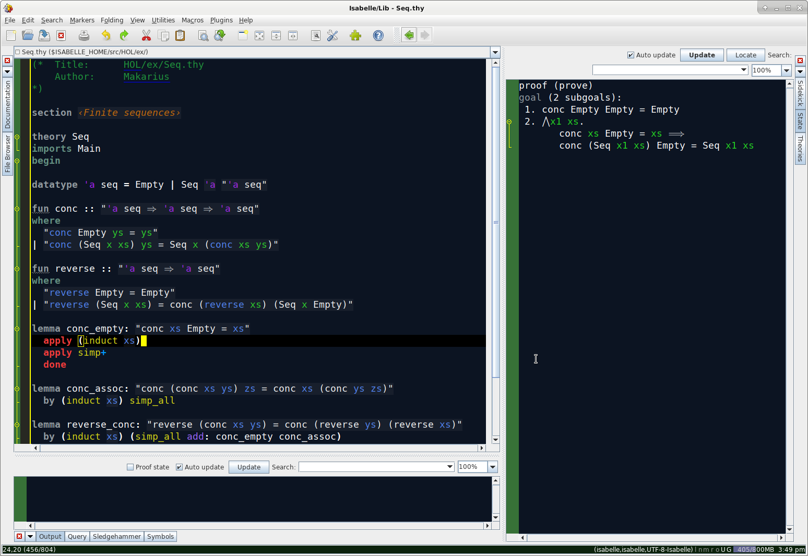

# Setting up Isabelle (flattened)
Since I find the existing confluence instructions a little confusing, I decided to write a flattened version of those instructions, mostly for my own notes.

> As these instructions are distilled from a number of existing guides, I add reference notes in quote blocks like this one.
> The top-level instructions are taken from https://confluence.csiro.au/display/RGPSST/Setting+up+Isabelle

## Getting the code
Depending on where you are, getting SSH access to the right github/bitbucket might be different. You just need keys to be able to clone from the right repository. I'll leave that to you. For public github you don't need any SSH stuff at all, if you're just cloning.

### Set up `~/.local/bin`
> Here we follow instructions from Zoltan's guide at https://confluence.csiro.au/display/~koc034/The+Proof+Engineer%27s+Guide+to+the+CSIRO+laptop.

We are going to install `repo` to `~/.local/bin`, so first we need to set up that directory and add it to `PATH`.
```
mkdir -p ~/.local/bin
export PATH=$HOME/.local/bin:$PATH
```
We also want this to be added to `PATH` for all future terminal sessions, so add `export PATH=$HOME/.local/bin:$PATH` to `~/.bashrc` (a file which you may have to create).

### Install `repo`
> More stuff from Zoltan's guide, installing `repo` directly from google to avoid python version issues in the `apt` version of repo.

Run the following to install repo.
```
sudo apt install curl
curl https://storage.googleapis.com/git-repo-downloads/repo > ~/.local/bin/repo  
chmod a+rx ~/.local/bin/repo  
repo
```
If the last command results in `error: repo is not installed. Use "repo init" to install it here` then everything worked as it should.

### Set up the `verification` repo
> At this point the confluence instructions direct you to https://bitbucket.ts.data61.csiro.au/projects/SEL4/repos/verification-manifest-internal, but instead we will follow instructions at https://github.com/seL4/verification-manifest.

Decide where you want your verification repo to exist. For me, it's `~/repos/`, so I will create a directory `~/repos/verification`.
```
mkdir verification
cd verification
repo init -u https://git@github.com/seL4/verification-manifest.git
repo sync
```
The `repo init` command should ask you some questions about your identity and colours. `repo sync` will download about 3.5GB of data, so might take a while.

> At this point we are finished with the instructions at https://bitbucket.ts.data61.csiro.au/projects/SEL4/repos/verification-manifest-internal and https://github.com/seL4/verification-manifest.

## Building Isabelle
> We are now directed toward https://bitbucket.ts.data61.csiro.au/projects/SEL4/repos/l4v/browse#isabelle-setup, which has its public equivalent at https://github.com/seL4/l4v.
> The first thing these pages do is direct you to https://github.com/seL4/l4v/blob/master/docs/setup.md / https://github.com/seL4/l4v/blob/master/docs/setup.md to set up dependencies.

### Dependencies
We now need to set up dependencies. Afaik not all of these are needed to run Isabelle proofs, but at least some are. If you are on Debian, run the following.
```
sudo apt-get install \
    python3 python3-pip python3-dev \
    gcc-arm-none-eabi build-essential libxml2-utils ccache \
    ncurses-dev librsvg2-bin device-tree-compiler cmake \
    ninja-build curl zlib1g-dev texlive-fonts-recommended \
    texlive-latex-extra texlive-metapost texlive-bibtex-extra \
    rsync
```
This will install a bunch of stuff, but shouldn't take too long. Now we can install some python dependencies.
```
sudo pip3 install --upgrade pip
sudo pip3 install sel4-deps
```
Haskell stack isn't needed for a lot of Isabelle proof work, but you can still install all of that with the following. Note that mine wasn't at `$HOME/.local/bin/stack`, but at `/usr/local/bin/stack`. No idea if that matters, but it hasn't caused issues for me.
```
curl -sSL https://get.haskellstack.org/ | sh
stack upgrade --binary-only
which stack # should be $HOME/.local/bin/stack
```

There's also a tool called MLton, which I haven't needed for any Isabelle proof work, but the tests won't pass without it. Current instructions say to get it from the [MLton website](http://www.mlton.org/). I haven't got MLton working on Debian, so these instructions will need to be updated when somebody figures out how to reliably install MLton in a way that works with the l4v tests.


## Setting up Isabelle

We now want to set up Isabelle, which we are going to set up in `l4v`.
```
cd l4v
mkdir -p ~/.isabelle/etc
cp -i misc/etc/settings ~/.isabelle/etc/settings
./isabelle/bin/isabelle components -a
./isabelle/bin/isabelle jedit -bf
./isabelle/bin/isabelle build -bv HOL-Word
```
These commands will perform the following steps:

-   create an Isabelle user settings directory.
-   install L4.verified Isabelle settings. These settings initialise the Isabelle installation to use the standard Isabelle  `contrib`  tools from the Munich Isabelle repository and set up paths such that multiple Isabelle repository installations can be used side by side without interfering with each other.
-   download  `contrib`  components from either the Munich or TS repository. This includes Scala, a Java JDK, PolyML, and multiple external provers. You should download these, even if you have these tools previously installed elsewhere to make sure you have the right versions. Depending on your internet connection, this may take some time.
-   compile and build the Isabelle PIDE jEdit interface.
-   build basic Isabelle images, including  `HOL-Word`  to ensure that the installation works. This may take a few minutes.

> At this point we are finished with the instructions at https://github.com/seL4/l4v/blob/master/docs/setup.md.
> The rest of this document (until Scott's notes) is taken directly from https://github.com/seL4/l4v.


## jEdit macros

We provide a jEdit macro that is very useful when working with large theory files,  **goto-error**, which moves the cursor to the first error in the file.

To install the macro, run the following commands in the directory  `verification/l4v/`:
```
mkdir -p ~/.isabelle/jedit/macros
cp misc/jedit/macros/goto-error.bsh ~/.isabelle/jedit/macros/.
```
You can add keybindings for this macro in the usual way, by going to  `Utilities -> Global Options -> jEdit -> Shortcuts`.

Additionally, our fork of Isabelle/jEdit has an updated indenter which is more proof-context aware than the 'original' indenter. Pressing  `ctrl+i`  while some  `apply`-script text is selected should auto-indent the script while respecting subgoal depth and maintaining the relative indentation of multi-line  `apply`  statements.

## Running the Proofs

If Isabelle is set up correctly, a full test for the proofs in this repository can be run with the command

```
./run_tests
```

from the directory  `l4v/`.
> Note: I wasn't able to complete the tests, due to MLton issues. These instructions need to be updated once I figure out a way to reliably install MLton on Debian.

Not all of the proof sessions can be built directly with the  `isabelle build`  command. The seL4 verification proofs depend on Isabelle specifications that are generated from the C source code and Haskell model. Therefore, it's recommended to always build using the supplied makefiles, which will ensure that these generated specs are up to date.

To do this, enter one level under the  `l4v/`  directory and run  `make <session-name>`. For example, to build the C refinement proof session, do

```
cd l4v/proof
make CRefine
```

As another example, to build the session for the Haskell model, do

```
cd l4v/spec
make ExecSpec
```

See the  `HEAPS`  variable in the corresponding  `Makefile`  for available targets.

Proof sessions that do not depend on generated inputs can be built directly with

```
./isabelle/bin/isabelle build -d . -v -b <session name>
```

from the directory  `l4v/`. For available sessions, see the corresponding  `ROOT`  files in this repository. There is roughly one session corresponding to each major directory in the repository.

For interactively exploring, say the invariant proof of the abstract specification with a pre-built logic image for the abstract specification and all of the invariant proof's dependencies, run

```
./isabelle/bin/isabelle jedit -d . -R AInvs
```

in  `l4v/`  and open one of the files in  `proof/invariant-abstract`.


## Scott's notes
> From here are some minor notes that I developed myself.

### Launching
The launch command that I found most useful for my particular work was the following, which I put in an executable `isabelle.sh` in my user directory. This runs everything under the ARM architecture.
```
L4V_ARCH=ARM ~/repos/verification/isabelle/bin/isabelle jedit -d ~/repos/verification/l4v -l Lib&
```

### jEdit colours



I prefer a dark theme for most things, but jEdit+Isabelle doesn't allow this option. I've found some colours I'm happy with, which you can set up if you like. There's no easy import/export for these colours, so you'll need to edit two config files manually. Make these edits while jEdit isn't running, because some settings are saved on close, which will overwrite any changes you made. You'll need to restart Isabelle/jEdit for the changes to take effect anyway.

General jEdit settings are found in the `~/.isabelle/jedit/properties` file. Below are the lines that I add to set up my colours (there might be some unnecessary stuff in here, I'm still working on paring this down).
```
#jEdit colour properties
console.caretColor=\#f8f8f0
jdiff.left-cursor-color=\#000000
jdiff.overview-changed-color=\#ffcc66
jdiff.overview-deleted-color=\#ff6666
jdiff.overview-inserted-color=\#99cc66
jdiff.overview-invalid-color=\#cccccc
jdiff.right-cursor-color=\#000000
log-viewer.message.debug.color=\#cccccc
log-viewer.message.error.color=\#660000
log-viewer.message.message.color=\#99ccff
log-viewer.message.notice.color=\#00cc00
log-viewer.message.warning.color=\#ff6633
tasklist.highlight.color=\#ffffff
vfs.browser.colors.0.color=\#ffa0a0a0
vfs.browser.colors.1.color=\#ff660066
vfs.browser.colors.2.color=\#ff666600
vfs.browser.colors.3.color=\#ff009933
vfs.browser.colors.4.color=\#ff990000
vfs.browser.colors.5.color=\#ff003366
vfs.browser.colors.6.color=\#ff006666
vfs.browser.colors.7.color=\#ff330066
vfs.browser.colors.8.color=\#ff666666
view.bgColor=\#ff0c1422
view.caretColor=\#ffffff00
view.eolMarkerColor=\#ff66ffff
view.fgColor=\#ffffffff
view.gutter.bgColor=\#377137
view.gutter.currentLineColor=\#ff3300
view.gutter.fgColor=\#cccc00
view.gutter.focusBorderColor=\#ffff00
view.gutter.foldColor=\#ffff00
view.gutter.highlightColor=\#ffffff
view.gutter.markerColor=\#669900
view.gutter.noFocusBorderColor=\#acacac
view.gutter.selectionAreaBgColor=\#272822
view.gutter.structureHighlightColor=\#cccccc
view.lineHighlightColor=\#ff000000
view.multipleSelectionColor=\#ff000000
view.pageBreaksColor=\#ff8080ff
view.selectionColor=\#ff660000
view.selectionFgColor=\#ff002b36
view.status.background=\#ff0c220c
view.status.foreground=\#ffffffff
view.status.memory.background=\#f666699a
view.status.memory.foreground=\#ffcccccc
view.structureHighlightColor=\#ffffff00
view.style.comment1=color\:\#ff87ceeb
view.style.comment2=color\:\#ffcd5c5c
view.style.comment3=color\:\#ff999900 style\:i
view.style.comment4=color\:\#ffcc6600
view.style.digit=color\:\#ffcc3300
view.style.foldLine.0=color\:\#ffffffff bgColor\:\#ff452424 style\:b
view.style.foldLine.1=color\:\#ffffffff bgColor\:\#ff625950 style\:b
view.style.foldLine.2=color\:\#ffffffff bgColor\:\#ff3c3c67 style\:b
view.style.foldLine.3=color\:\#ffffffff bgColor\:\#ff314444 style\:b
view.style.function=color\:\#ff98fb98
view.style.invalid=color\:\#ffff0066 bgColor\:\#ffffffcc
view.style.keyword1=color\:\#fff0e68c style\:b
view.style.keyword2=color\:\#ff009966 style\:b
view.style.keyword3=color\:\#ffcc6600 style\:b
view.style.keyword4=color\:\#ff66ccff style\:b
view.style.label=color\:\#ffffdead style\:i
view.style.literal1=color\:\#ffffa0a0
view.style.literal2=color\:\#ffcc6600
view.style.literal3=color\:\#ffffcc00
view.style.literal4=color\:\#ffffffff
view.style.markup=color\:\#ffbdb76b
view.style.operator=color\:\#ff9b9b9b style\:b
view.wrapGuideColor=\#ff8080ff
white-space.block-color=\#006633
white-space.fold-color=\#ffff66
white-space.space-color=\#727b84
white-space.tab-color=\#6c92b8
white-space.whitespace-color=\#ff6600
```

Isabelle-specific settings are found in the file `~/.isabelle/etc/preferences`. Add the following lines to that file. Note that the first two lines below are not colour-related, but are very helpful.
```
jedit_completion_delay = "0"
vampire_noncommercial = "yes"
active_color = "8A8181FF"
active_hover_color = "89BD39FF"
antiquote_color = "25C431FF"
antiquoted_color = "FFC83264"
bad_color = "431818FF"
bound_color = "23D323FF"
canceled_color = "994949FF"
comment1_color = "20933CFF"
comment3_color = "22C437FF"
dynamic_color = "4F982CFF"
error_color = "AB1F1FFF"
error_message_color = "6F272EFF"
free_color = "4B82FDFF"
improper_color = "F53B3BFF"
information_color = "4E788DFF"
information_message_color = "4886AEFF"
inner_numeral_color = "DF0808FF"
keyword1_color = "929BA0FF"
keyword2_color = "649182FF"
legacy_message_color = "716D4BFF"
operator_color = "D7D716FF"
raw_text_color = "1FDE67FF"
running1_color = "990999FF"
running_color = "AC13ACFF"
tooltip_color = "404001FF"
unprocessed1_color = "2F2020FF"
var_color = "B17513FF"
warning_message_color = "774D83FF"
writeln_color = "7D7D7DFF"
writeln_message_color = "404872FF"
```
